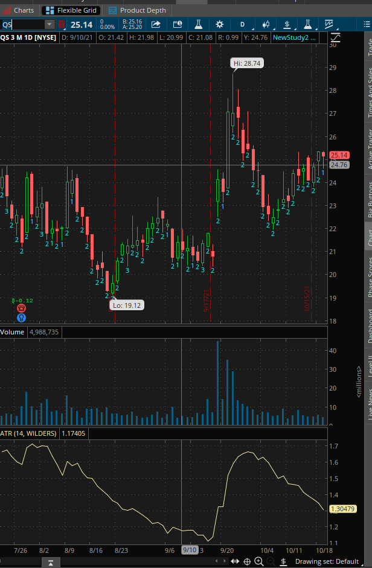
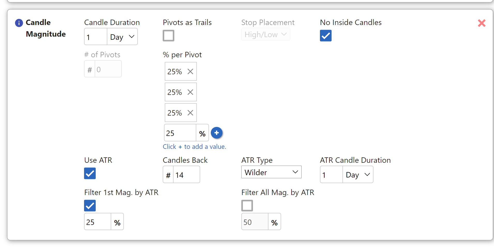
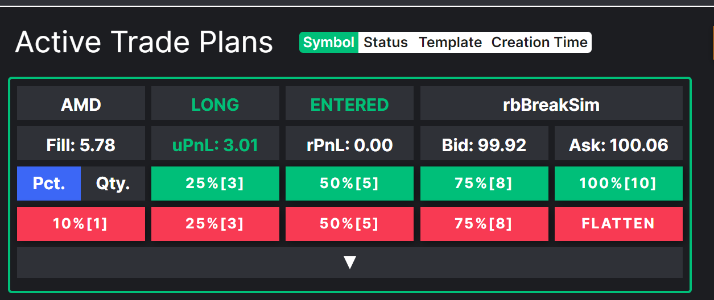
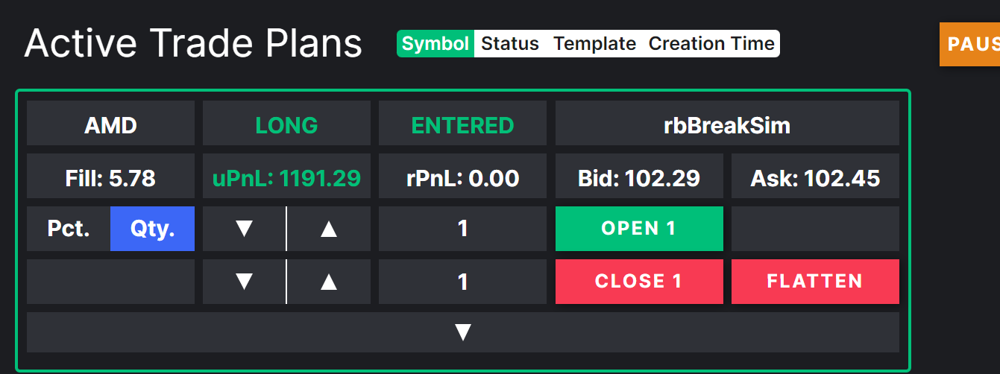
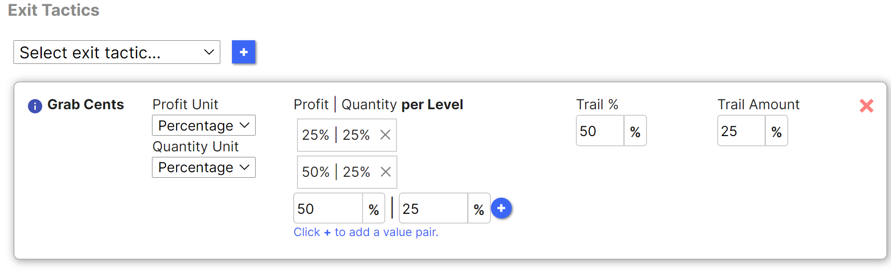

# Catch-all

This is a catch-all bucket where you can find various short videos, answers to questions, and brief explanations.

We will try to organize the information better over time, but at least it's available here.  Think of it as a treasure hunt.  ;-)

----

12/7/21

Candle Magnitude Exit Tactic

basic explanations:
https://wiki.tradeunafraid.com/getting-started/trade-plans/exit-tactics#candle-magnitude

editing candle mag targets and stops:
https://www.screencast.com/t/AR9izxst1ERZ

what are the first stop and first target stop video:
https://www.screencast.com/t/JIAcJFvv

generating pivots based off atr when no magnitudes remain:
generating pivots based off of the atr when no pivots remain
https://www.screencast.com/t/q1vKfNgbcbK

how to "manipulate" the candle magnitudes exit to ignore pivots, and only take profits at specific %'s of ATR
https://www.screencast.com/t/PaEFAeVp71iA

example of using "filter atr by pivot" + "use atr instead of pivot":
https://discordapp.com/channels/775066360963006484/854065252823203850/900736765114077205

To explain the "filter all mag" and "% of ATR as mag", let's use QS as an example. let's say we set up a tradeplan to enter long on the break of inside day at 25.35

without any of the ATR functionality, the machine would find pivots at 25.36, 25.63, 27.08, 28.05, 28.74
The first thing that should stand out as an issue is the first pivot at 25.36, which is one penny. This is a magnitude that you are probably going to want to skip. This is where "filter all mag" comes in. It will filter out a clustered pivot.

Let's use the above configuration, in which filter all mag was set to 10%. 10% of the ATR (1.7 in the image) is 17 cents.

This filter works as follows: take the entry/lastPivot and add that 17 cents to it. Any upcoming pivots below that range get filtered out. This happens with every potentially new pivot. As a result, the too near pivot of 25.36 will get filtered out. The upcoming pivot after that, at 25.63 will become the first pivot

The second issue that should stand out to you about the above pivots is after that 25.63 pivot, the pivots become really extended, and you need long pivots to reach those pivots. This is where the % of ATR as mag comes in to play. It allows you to replace a pivot with % of ATR

Let's use 50%, like in the above configuration. 50% of the ATR (1.7) is around .85. Any time the pivot is further out than this range, we will use this as the magnitude instead. Just to reiterate, the above is a filter that says anything within a range, ignore the pivot. This says the opposite, anytime a pivot is outside of this range, use the % of atr as a pivot instead.

So let's walk through the example now...
The first number we are looking at is 26.2. This is the entry price of 25.35 + half of the atr of .85. The first pivot that passes the filter test above is 25.63. This pivot is below 26.2, so the software allows this to be used as the first pivot.

The next pivot though is 27.08. If you take 25.63 (the last pivot) and add .85 (half the atr), you get 26.48. 27.08 is well beyond 26.48. Therefore, our second target, instead of being 27.08, is tracked at 26.48.

Our list of targets at this point would be 25.63 and 26.48
I can keep going with the above example, but let me know if this makes sense. These two features provide both the goal of ignoring magnitudes that are too clustered, and using atr instead of magnitude as a target if the next magnitude is too far away

another example on facebook:
https://www.screencast.com/t/ZVqjV9kyzQ5O

5min vid on "use atr":
https://www.screencast.com/t/5XJr5sLZhUe

example of pins from 10/18:

https://www.screencast.com/t/5XJr5sLZhUe
quick example here... this is saying that if the first pivot is within 25% of the ATR from the entry price, to skip this pivot, and use the next.

so if you look at pins, the ATR on TOS using 14 candles back on the daily chart and wilders is 1.78. 25% of that is .45.

The way the software works is as follows: Let's say you were to take inside day break on pins at 53.27. The software will go 53.27+.45=53.72. Any pivot that can potentially be the "first pivot" will be ignored. this means that first pivot on the 3 bar at 53.4 will be passed. the next pivot at 54.03 will be used instead. once the first pivot is found, this filter is deactivated
this example, is saying to filter all pivots by 20% of the ATR. this is different than the first filter in that it will not only apply to the first pivot, but to all pivots found after

The example I used in the video was wday. With wday, lets say you were to take inside day break at 272.35. Wday has an atr of 6.93. 20% of the ATR will equal 1.39.

Without this filter, wday would have pivots of: 273.55, 273.98, 274.98, 275.63, 277.58, 278.23 (The software would find more going further back in time, but for the sake of this example, we will stop here).

With the above atr filter, the software will select pivots as follows:
272.35 (entry) +1.39 (percent of atr) = 273.74. This means that the first pivot of 273.55 will be ignored. The first pivot chosen will be 273.98.

273.98 (last pivot) +1.39=275.37. The 274.98 pivot will be ignored, and the 275.63 pivot will be used next instead.

275.63 (last pivot) + 1.39 = 277.02. The next pivot of 277.58 will be used next.

277.58 (last pivot) + 1.39 = 278.97. the pivot at 278.23 will be ignored.

Therefore, we are left with pivots at 273.98, 275.63, and 277.58

----

12/1/21

using a saved config to get into an otm1 option... I think its about 7-8 clicks. The alternative is already having the stock up in a tradeplan and then just clicking enter long or enter short https://www.screencast.com/t/IJ89l8b2G3

manual selection from option chain, obviously a little bit slower
https://www.screencast.com/t/OJexdrFkiy4

----

1/13/22

Underlying Price Exit:
https://www.screencast.com/t/LdKJ3eDdsW

Placing targets for options on underlying chart:
https://www.screencast.com/t/ymnwTQAw88B

----
11/30/21

this is the new tradeplan header for when you are in a position. the new feature is the ability to add to the position from this module. You can also add or subtract to the position, via pct (the left image), or qty (the right image). With percentage, keep in mind it works the same way as the closing buttons. The percentage is always relative to the total qty bought in the course of this tradeplan. So if you originally had 5 contracts, and you hit 100%, and now had 10 contracts, if you hit 100% again, it will purchase 10 more contracts, and you will now have 20 contracts. video incoming...

https://www.screencast.com/t/GppSRdf7rLKz tutorial on the new buttons

----

1/6/22

Worked Orders:

if the trade is bto, and the % between bid ask was 0%, the limit order would start at the bid.

if the trade is sto, and the % between bid ask was 0%, the limit order would start at the ask.

----
11/25/21

tutorial on how to split and separate parameters on entry and exit for work order
https://www.screencast.com/t/tmFxezY564g

break by on trigger candle for candle pattern setup tutorial..
https://www.screencast.com/t/DXWUu5DLcS

manual reactivate long/short on candle trigger setup tutorial (manual unbonking)
https://www.screencast.com/t/MqLhZj1r

----

11/23/21

editing candle mag exit in new UI
https://discordapp.com/channels/775066360963006484/912087423956172800/912718373278867497

how to "manipulate tu" to be able to trade like you would on another platform. ie enter from an existing chart, manual exits that type of stuff. It is a bit of a hack, but it is effective
https://www.screencast.com/t/wYpQrAoO

how to compare fill versus quote at time of attempted trade. could be useful for evaluating work order results
https://www.screencast.com/t/imXfgVkY

----
10/29/21

video explanation of the initial stop and first target stop for ATR. sorry its 8 minutes once again.. just a lot of stuff to include
https://www.screencast.com/t/zKorqYBkbew

just a quick explanation of what to be aware of if trading on different timeframes... https://www.screencast.com/t/nPPTlPZdq55

----

1/2/22

MFE Retracement

It's saying if pnl reaches a certain amount (defined by either an amount or %), never let it retrace below x%. This is like what you said above. The additional wrinkle is that as profit increases, the stop will increase/expand along with it. So when pnl is 500, if the retrace pct is 50%, the stop will be 250 pnl. When pnl is 1000, the stop will be 500 pnl.

To do the settings in this message,
1) you would set mfe type to pnl, 2)activation type/setting to amount,
   3)pnl type to overall,
4) activation amount to 500
5) retrace pct to 50%

----

12/31/21

Mfe Retracement Documentation:
online documentation:
https://wiki.tradeunafraid.com/en/creating-a-trade-plan/exit-tactics/mfe-retracement

video explanation of fields:
https://www.screencast.com/t/C8yaY9Lg

live example on simulated data:
https://www.screencast.com/t/amTLGD1hIm

----

12/30/21

grab cent with qty unit of percentage, profit unit of percentage examples.

for all these examples, let's assume a fill price of $1 and qty of 8.

_Image One_

the first image, is saying put one order out for a 25% gain for 25% of the position, and another for 50% gain for another 25% of the position. For the last 50%, create a 25% position price trail (like youd have on TOS) that kicks in once that order is filled. This 25% is based on the original fill price.

So this translates to 2 orders: order1 will have a qty of 2 and limit price of 1.25, order2 will have a qty of 2 and limit price of 1.5. A $.25 price trail (25%) will be created once those 2 orders fill

_Image two_

the second image, is saying put one order out for a 25% gain for 25% of the position, another for 50% gain for another 25% of the position, and one more for a 100% gain on 50% of the position. There is no price trail.

So this translates to 3 orders: order1 will have a qty of 2 and limit price of 1.25, order2 will have a qty of 2 and limit price of 1.5, and order3 will have a qty of 4 and a limit price of 2.

----

12/22/21

simplest ways to trade TheStrat with TU:
1. enter on break of previous candle
   setup: adhoc
   entry: candle break
   exit: candle trail
   if take profit: candle magnitude
2. for trading break of previous day/week/month high
   setup: candle trigger
   entry: market order
   exit: candle trail
   if take profit: candle magnitude
3. for trading a specific sequence on the intraday time frame
   setup: candle pattern
   entry: market order
   exit: candle trail
   if take profit: candle magnitude

----

Nav Bar

https://www.youtube.com/watch?v=vjXUr7dLDoI&list=PLKjQe4oyXLvKmtBLmnVOcUMiFsMbRVNal

----
12/11/21

example vid of manual option selection from a few days ago: https://www.screencast.com/t/OJexdrFkiy4

an otm1 option saved config that you can use as an "enter now tradeplan": https://www.screencast.com/t/IJ89l8b2G3

----

12/21/21

How to "manipulate" the candle magnitudes exit to ignore pivots, and only take profits at specific %'s of ATR
https://www.screencast.com/t/PaEFAeVp71iA

Generating pivots based off of the atr when no pivots remain
https://www.screencast.com/t/q1vKfNgbcbK

How to alter work order settings of an existing tradeplan:
https://www.screencast.com/t/mHtZ20oEaDr

How to add an ATR trail (or modify it)
https://www.screencast.com/t/pGe3MGuq

