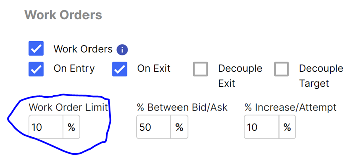
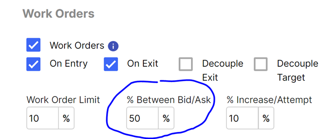
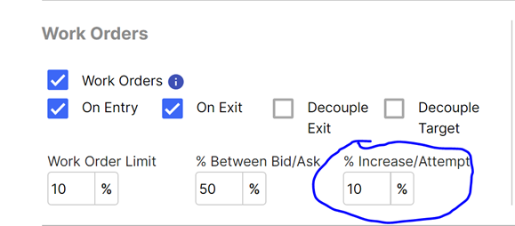
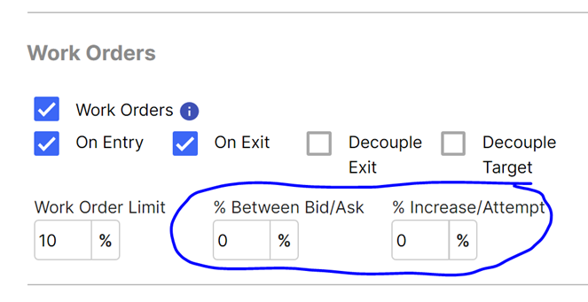
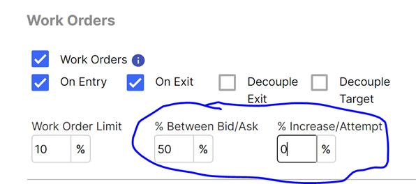
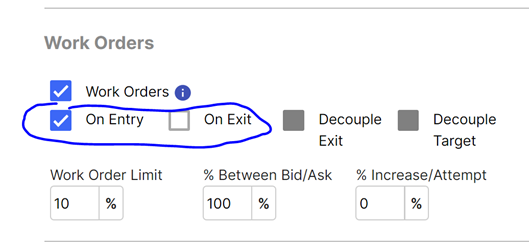
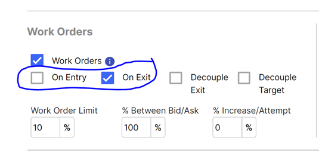
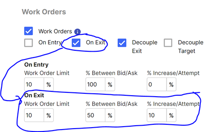
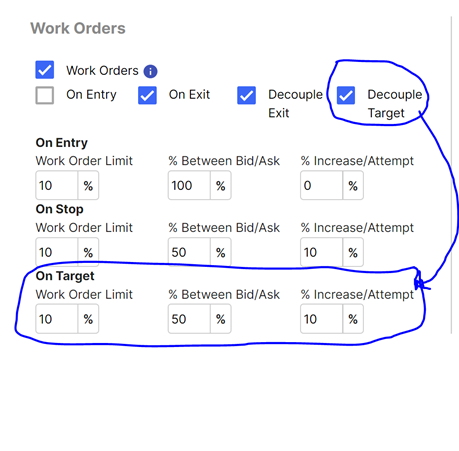
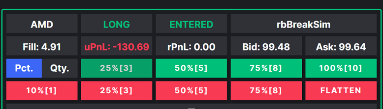

# Worked Orders B

This is a second document on worked orders.  We need to reconcile these two pages, but for now, all the information is accessible.

#### Work Orders:
Work orders is a feature of Trade Unafraid that allows a user to try and get a fill on a trade in between the bid and the ask. This feature is a favorite, and can be a big money saver compared to blindly working with market orders, although it is quite complex. The following is an in-depth explanation as to how the feature works.

#### Mechanics:
Work Order has two processes that are constantly running and trying to work the order. There is one process that operates based on a timed interval, and another that reacts quote by quote. The first one is much more **proactive**, whereas the second is much more **reactive**.
Work Order by time interval: This process tries to adjust the limit price 1/4 of a second IF work orders has not modified the order in that period of time. It will take the last quote and try and work the order again.
Work Order by Quotes: This process tries to adjust the limit price based on every incoming quote. It will consider the parameters that were provided to work order and recalculate what the limit price should be based on the new quote we receive.
For both processes, an in-depth explanation of the fields and how they result in new limit prices is below. It is important to note that if the attempt to calculate a new limit price is <= the last limit price if long, or vice versa if short, the limit price is amended to the previous limit price plus the smallest increment possible for that option. As an example, let’s say we are trying to buy calls and the current limit price is 1.05. If the new limit price is calculated to be 1.02, instead of decreasing the limit price, when we know we can’t get a fill there anyways, we will adjust the limit price to 1.06. If you try and sit on the bid/mid/ask (more on that later), this functionality, and the Work Order by time Interval,  is turned off.

#### Explanation of Fields:
###### Work Order Limit:
This field is available as a safety feature for work orders. It can happen many times, especially at the open, that you try and work the order, and the underlying moves a dollar in a matter of seconds in the direction that you want. If this happens, you can often find yourself entering at the very bottom and result in a sizeable loss. This feature is made as a protection against this scenario, and would most likely be used by option’s traders, as equity will not see the same volatility as an option trade.
How does it affect the trade plan itself? If you are entering the trade, it will cancel the trade, and either terminate the trade plan, or if is repeating is selected, it will progress to the restart process, whether that means the trade plan is deactivated, or looking for a setup again. If you are exiting the trade though, it will stop trying to “work the order” and place a limit order at the bid if long or ask if short the instrument.

Let’s do an example with numbers. Let’s say you are trying to go long the otm1 call, and the current spread is bid: 1, ask 1.07. Additionally, let’s say you set the work order limit field to 10%, as the image above demonstrates. If you are entering, we will take the ask of 1.07, and add 10%, which is 1.18. If while entering the trade, the ask goes above 1.18, the trade will be cancelled.

Now let’s use the same example, but for exiting the trade. This time, we will take the bid of 1, and find the price that is 10% below the bid, which is .9. If TU gets a quote below .9, it will stop working the order, and place a limit order at the bid it received. If you get a quote with bid .88 and ask .92, a limit order at .88 will be placed.

###### % Between Bid/Ask:
When you work an order, the approach comes down two questions: 1) Where in between the spread do you want to start working the order? 2) How much closer to the offer do you want to get per attempt, how fast do you start to give up? This field attempts to answer the first question.

Let’s say we do 50%. As in the image above. This means that the limit price will be placed at the mid of the bid ask. So if the first quote is bid 1.0, ask 1.1, the first order will be placed at 1.05. It is important to note that the order will update for EVERY incoming quote. So, ignoring the field % Increase/Attempt, if the next quote is at 1.06-1.12, then the limit price would be 1.09. If the quote after comes in at 1.04-1.1, then the price will adjust to 1.07.

###### % Increase/Attempt:
When you work an order, the approach comes down two questions: 1) Where in between the spread do you want to start working the order? 2) How much closer to the offer do you want to get per attempt, how fast do you start to give up? This field attempts to answer the second question.

This field defines how much closer to the ask do we want to go every single time we try and modify the order. Let’s jump into a numbers example, as this will make this much easier to understand. In the above configuration, we have set the “% Between Bid/Ask” to 50%, and the “% Increase/Attempt” field to 10%. What this means is that every time we try work the order, we will get 10% closer to the ask if buying, or the bid if selling. The next we try place an order, the percent between the bid ask will be at 60% (50%+10%). The next time, it will be at 70% and so on.

So let’s illustrate an example using quotes of how this would play out. Let’s say the first quote is bid 9, ask 10. With the percent between Bid/Ask at 50%, the first limit price would be 9.5. Let’s say the next quote is the same, at bid: 9.5 ask: 10. The limit price would now adjust from being 50% between the bid ask, to 60% between the bid ask. The new limit price would therefore be 9.6. It is also important to note that this does not just work based on the first bid ask, we receive, but updates per every single quote. Continuing from our previous example, in which the limit price was 9.6, and the % between the bid ask has been adjusted to 60%, let’s say our next incoming quote comes in at bid of 9.6, and ask of 10.2. We would increase the last % between the bid ask from 60% by another 10% to 70%. 70% of the 60 cent spread is 42 cents. Therefore, the new limit price would be at 10.02.

#### Sitting on bid/mid/ask configurations:
The following images will demonstrate how to sit on the bid, the mid, or the ask when working the order. As mentioned above, TU works the order based on two factors: 1) a time interval, 2) per quote received. When sitting on the bid/mid/ask, the first process mentioned in the “Mechanics” documentation, the time interval, is shut off. It reacts purely based on each quote it receives. This is communicated to TU by setting the “% increase/attempt” field to 0. This tells TU, we are sitting on some point between the spread. Besides this, the software works just as it would in terms of the documentation provided for “work order limit”, “% between the bid ask”, and “% Increase/Attempt”. We will update per quote. That means that if you are trying to sit on the mid, and the first quote of b: 1, a:1.1, results in a limit price at 1.05, and then the upcoming quote is b:1.05 a: 1.11, the limit price will adjust to 1.08. Work order limit works the exact same, and it essentially places a safety net on the trade.
###### Sit on bid if buying or ask if selling configuration:

###### Sit on ask if buying and bid if selling configurations:

###### Sit on mid configurations:

#### Working only on either the entry or the exit:
By default, Work Orders applies on both the entry, and the exit. However, if the user would like to only use work orders on the entry, but not on the exit (let’s say you want to get in as fast possible, and are ok with a market order), or if he would like to only apply it on the exit, and not on the entry (let’s say if the user is getting stopped out, he wants to place a market order and get out asap), work orders can be configured for this as well.

###### This configuration would only work the order on the entry:

###### This configuration would only work the order on the exit:

#### Setting up different configurations for entry, target, and stop
Additionally, a user might want to “decouple” the settings for entries, targets, and stops. On an entry, the user might want to be more patient, and try to wait for the market to come to his order. On a stop, the user might want to be very aggressive trying to get out as fast as possible and be conversative working the order. Lastly, when the user is trying to take profits, they might want to be make sure the market comes to them and delivers maximal profits by sitting on the ask. There are various reasons for treating each situation differently. For each, you can define the parameters.

###### By selecting “Decouple Exit”, you can provide different parameters for the stop relative to the entry.

Working the order on a target applies currently to 2 situations: 1) using 1 of the close percentage buttons. 2) taking profits at on an option trade via the candle magnitude exit. You select “decouple targets”, and the option is available to set however you think is most appropriate for your trading. Additionally, if “Decouple Exit” is selected, you can have different parameters 1) for the entry, 2) for the target, and 3) for the stop.
The tricky part about these parameters is that this is technically either a sell to close, or a buy to close. That means the parameters function the same way as the stop parameters. If you want to place an order that is sell to close, and have the first order have a limit price at the ask, the field “% between Bid/Ask” would be 0%. If you were trying to buy to close and wanted the first limit price to be placed at the bid, the field “% between Bid/Ask” would be 0%.

#### Trade Plan Close Buttons:

This section will explain how “Work Orders” applies to the above close position controls. If Work Orders “On Target” is selected, then all the close percentage or close quantity buttons will use the “On Target” work order settings (in other words, all the options besides “FLATTEN”. The “FLATTEN” button will always use the Work Order “on exit” settings if that is selected.
#### Video explanations:
###### Staying on bid, mid ask: 
https://www.screencast.com/t/kexL5Mkykti

###### Split configuration for entries versus exit: 
https://www.screencast.com/t/tmFxezY564g

###### How to decouple targets: 
https://www.screencast.com/t/Xa99jAKN

