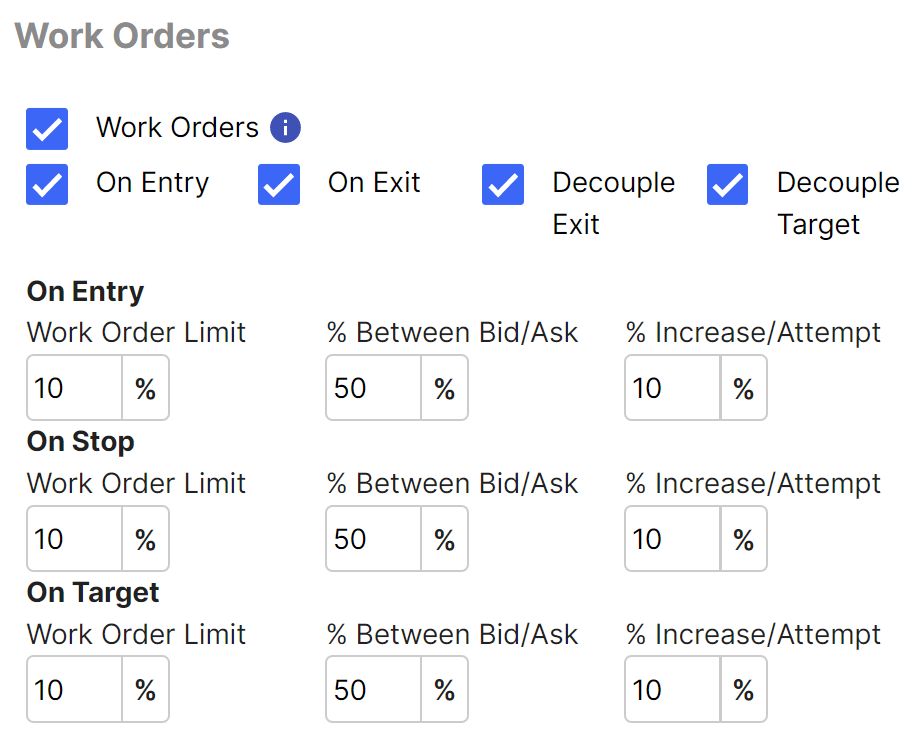

# Worked Orders
You can set up a Trade Plan to try to get filled inside the spread.  This is known as "price improvement," and it can help a lot to get a better price.  It really helps if you can do it both on the way in (opening) and on the way out (closing).

A conceptual order book represents the buyers and sellers in any market.  There are buyers bidding at various prices, and there are sellers asking or offering at various prices.  The National Best Bid and Offer (NBBO) reflect the current market, i.e. the prices available for trading at that moment.  Any market order can be placed to buy at the ask or sell at the bid, at any moment.  The spread is the difference between the best bid and the best ask.  A wide spread means you need some decent movement just to break even.

:::note 

It is also worth noting that bidsize and asksize can be important factors in the order book.  You might find an ask price of 12.00, but if the asksize is only 1 share, and you try to buy 100 shares, you could be sorely disappointed by what you end up paying for the other 99 shares.  As with many aspects of trading, Trade Unafraid watches for such situations and will change your market order to a limit order to protect you from paying 12.50 or 13.00 or more for those other 99 shares. 

:::

When you tell Trade Unafraid to work your orders, it will attempt to get you filled inside the spread.  This means, rather than simply buying the ask or selling at the bid, the software will place a limit order at some price in between the bid and ask.  You control how aggressively you start, as well as how quickly you acquiesce.  You also get to say how far you're willing to go before giving up on working the order.  There are times when this approach works against you, and the market moves the wrong way.  In these cases, you may end up paying more or selling for less than what the original NBBO was when you started.  Like everything in trading, it's a game of probabilities.  Sometimes they go in your favor, but not always.

The checkboxes at the top can be used to enable or disable the process of working orders under various circumstances.  To turn the feature off completely, uncheck the top Work Orders checkbox, and Trade Unafraid will not attempt to get you a fill inside the spread.

The remaining checkboxes determine which types of orders will be "worked."  Any order type that is not being worked will simply be executed as a market or limit order, without attempting to get any price improvement.

For this process, we can distinguish between opening orders (On Entry) and closing orders (On Exit).  We can further distinguish between exiting to take a profit versus exiting at a stop.  Because these different order situations come with their own risk/reward profiles, it makes sense that you may want to treat them differently when trying to get price improvement.  As you check and uncheck the various checkboxes, you will see the rows of Work Order parameters come and go to match the scenarios defined by the checkboxes.  The parameters in each row have the same meaning in all cases.

#### % Between Bid/Ask
This field determines how aggressively you want to start out trying to get a favorable fill.  50% means you want to split the spread in half and start with a limit order right in the middle.  Whether you are buying or selling, opening or closing, a smaller number means you are stubbornly trying to get the best possible fill.  If you put 0% in this field, you are trying to buy at the bid or sell at the ask.  On the other hand, if you put 100% in this field, you are effectively placing a market order by buying at the ask or selling at the bid.

#### % Increase per Attempt
This field specifies how aggressively you will adjust your order with each new quote or each quarter-second that passes without a fill.  The larger this number, the more quickly your order will make its way to a fillable order in line with the NBBO.  It also will depend on how quickly the market quotes are updating.  For a highly liquid instrument like SPY, quotes come in very quickly, and each quote will cause your worked order to move closer to the NBBO.  In an very illiquid, thinly traded stock or option, it may be the quarter-seconds that cause your orders to update, rather than the steady stream of quotes.

#### Work Order Limit

This field is available as a safety feature for worked orders. It can happen many times, especially at the open, that you try and work the order, and the underlying moves a dollar in a matter of seconds in the direction that you wanted.  So, if you were looking to buy, price has moved up significantly from where it was originally available.  If this happens, you can find that your attempt at "price improvement" has worked against you, and your price has incremented up, effectively chasing the price far from where it started out.  At this point, an entry could prove to be unfavorable. This Limit feature is designed to protect against this scenario by defining a maximum increase in price from the original trigger to be used as a cap.  This limit would most likely be used by options traders, as equity will not see the same volatility as an option trade.

:::note Important note

**Entries and exits are treated differently.**

If you are attempting to enter a trade when this limit is reached, the trade will be cancelled, rather than chasing price to an unfavorable point.  If cancelled, the normal lifecycle management rules apply.  If not repeating, this will simply terminate the trade plan, or if repeating is selected, the restart process will kick in, whether that means the trade plan is deactivated, or looking for the next setup.

If you are exiting the trade when this limit is reached, Trade Unafraid will stop trying to “work the order” and will place a limit order at the bid if long, or ask if short, abandoning the effort to get price improvement and simply trying to exit.

:::

### An Example

Let’s do an example with numbers. Let’s say you are trying to buy a call, and the current spread is 1.00 x 1.07. Additionally, let’s say you set the work order limit field to 10%, as the image above shows. If you are entering, Trade Unafraid will take the original ask of 1.07, and add 10%, which is 1.18. If while attempting to enter the trade, the ask goes above 1.18 without getting filled, the trade will be cancelled.  This is intended to protect you from overpaying compared to the 1.07 you could have paid at the outset when your setup triggered.

Now let’s use the same example, but for exiting the trade. This time, we will take the bid of 1.00, and find the price that is 10% below the bid, which is 0.9. If Trade Unafraid gets a quote below 0.9 before it gets filled, it will stop working the order and place a limit order at the bid it received. So if you get a quote of .88 x .92, a limit order will be placed at .88 to "stop messing around" and get you out.

### Pro Tip
If you want to be recalcitrant about it, you can hold firm without budging by setting **% Increase per Attempt** to zero.  This means you will not move from your **% Between Bid/Ask** setting.  As the market moves, you will hold fast to your percentage of the spread.  (Note: Your order becomes the new NBBO, so there is a bit of a feedback loop here that makes things a little fuzzy.  By placing your order, you effectively tighten the spread.)

If you want to be truly obstinate, you can also set **% Between Bid/Ask** to zero.  By setting both of these to zero, you are basically telling the market you are willing to wait forever for a truly great fill.  As the quotes move, your buy order will sit on the bid, or your sell order will sit on the ask.  If you are willing to risk never getting filled, this is one way to ensure you only get great prices on the fills that do happen.

### When to be aggressive
It makes good sense to be aggressive about entry fills.  There is no harm (other than opportunity cost) in not getting filled.

The next most aggressive orders could be when hitting your targets.  You can afford a bit a patience to get the best fills on targets (though some of your targets will already be limit orders, so they can't really be worked orders).

The place where you really want to think twice about aggressively working orders is on your stops.  If you're already losing money or giving up profits, that is probably the wrong time to dig in your heels and try to get a better price.  Be careful about working stop orders.  A falling market is the wrong time to try to save a few cents.

:::info

| Exit tactic | Stock | Option                       |
| --- | ------ |------------------------------|
| Grab Cents | Limit orders | Limit orders                 |
| Ratchet Brackets | Limit orders | Market orders (can be worked) |
| Candle Magnitude | Limit orders | Market orders (can be worked) |

:::

