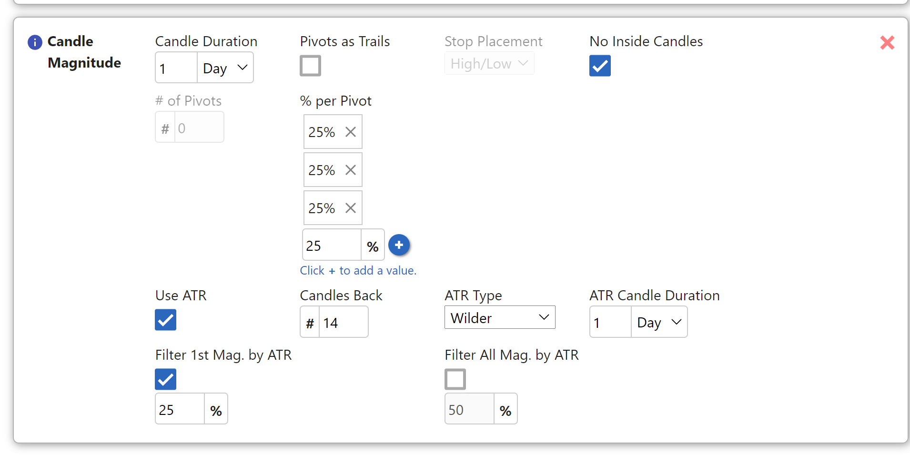
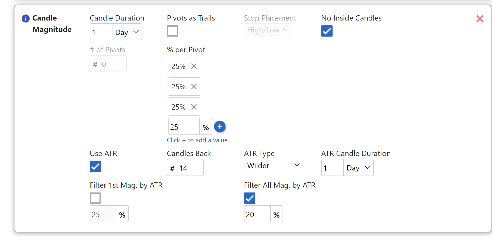

# Candle Magnitude Exit Tactic

## Overview

This exit tactic will set targets at the highs (if long) or lows (if short) of earlier candles, with the goal of taking incremental profits as the price hits each pivot. If you are familiar with "The Strat" trading methodology, this is known as *taking profits at magnitudes*. Additionally, the tactic includes a **Pivots as Trails** option in which, after each target is reached, the previous pivot candle can be used as a stop for the remainder of the position.  In this way, each time a target is achieved, the stop is ratcheted up to the prior target.  The lists of targets and stops can be adjusted manually, if desired.

This tactic can be utilized whether trading stock or options. When trading stock, limit orders will be placed at the magnitudes. With options, triggers will be placed at the magnitudes that will sell off a portion of the position when the magnitude is hit.  In either case, the quantity to be closed is determined by the user.  A quantity of 0 is also valid as a way to define a point to ratchet up the stop while still holding the same position.

**Important Note:** *It is strongly advised to use this tactic in combination with another stop loss tactic. This is due to the fact that until the first target is taken out, there is no stop set.*

It is also advisable to double-check the magnitudes selected, especially if trading on lower time frames. The targets are just looking for higher candle highs or lower candle lows, and you may enter into a trade with a cluster of targets, or a target very near the entry. In this case, it may be best to manually remove some targets, which can be done from the active trade plan section. We have many ideas to expand this functionality in the future, such as using ATR as a way to “space” the targets.

To be clear, these targets are based on candle highs or lows, but they are not pivots in the way that most traders think of them.  If there is a sequence of ten red candles to the left of the entry, that may represent a single pivot to most traders, but the Candle Magnitude exit tactic could place a target at each candle high in that sequence.  In The Strat terms, this is a *pivot machine gun*, and a target can be placed at each "pivot" or candle high.

## Parameters
> **Candle Duration:**  The time frame that the tactic will use for evaluating the chart for candle highs/lows.
>
> **Pivots as Trails:** Determines whether the tactic will add a corresponding stop for each pivot.  If unchecked, the tactic will not set stops, only targets.
>
> **Stop Placement:** If **Pivots as Trails** is selected, this option allows you to choose whether the stops will be placed at the high (if long)/low (if short) or at the midpoint of the pivot candle.  You will have tighter stops with High/Low and looser stops with Mid Point.
>
> **No Inside Candles:** Determines whether inside candles will be used as pivots. If this is selected, it will filter out inside candles and not use them as pivots.
>
> **# of Pivots:** This is only applicable if **Pivots as Trails** is selected. This will determine how many targets/stops would would like to use. If **Pivots as Trails** is not selected, the number of targets will be ascertained solely from the **% per Pivot** list input.
*For example, if you attempt to take profit at three pivots, this field allows you to define, say, 7 pivots and use the remaining 4 as prices to ratchet your stops only.*
>
> **% per Pivot:** This field allows you to define a list of percentages. These percentages represent the percentage of your position that will be sold at each corresponding pivot. For example, let's say you enter the values: 10%, 15%, and 20%. At the first pivot, 10% of your position will be sold, then at the second, 15% will be sold, and at the third pivot 20% will be sold.
*This is a list input that allows you to add multiple values. To add a value, enter it into the box, and push the **+** button. You will see a box containing the value appear above the input. To remove a value, simply click the **x** in the corner of the box.*
>
>**initial stop**: If use Pivots as trail is selected, then this is used as the first stop after entry. More on this later...
>
>**1st target stop**: If use Pivots as trail is selected, then this is used as the stop once the first target is hit. More on this later...
>
> **Use ATR**: Select this to use ATR in this exit tactic. ATR can be used to filtering pivots, replacing pivots, or for creating stops.
{.is-info}

## Examples

### Candle Duration Example
In this example, we are using the 1-day **Candle Duration**. The tactic is configured to take 10% at each of the 5 targets. Notice that because we are not using the **Pivots as Trails** option, the number of pivots is inferred from our list of percentages.

See the example below for a visual representation of these pivots. The chart below assumes that you are entering long on the newest candle at the far right.  The green lines represent the five targets based on the highs of the prior candles.  At each of these candle highs, 10% of the position would be sold.  No stop would be set, and the remaining 50% of the position would have no target.  This is a somewhat "incomplete" use of the Candle Magnitude exit tactic that would need to be combined with one or more additional exit tactics to create a "complete" trade plan.

*It is also worth noting that Trade Unafraid currently deletes exit tactics at midnight for open positions, so this example would only set these targets during the day when the position first opens.*

### Pivots as Trails Example
With the use of the **Pivots as Trails** checkbox, instead of utilizing the exit tactic as a way to simply take profits at magnitudes, you can also use it to create ratcheting stops based on the previous candle magnitudes. This feature essentially allows you to morph this tactic from something that just takes profits, to a ratchet bracket, with the target being the future magnitude, and the stop being the prior magnitude.  As each target is reached, the bracket (both target and stop) shifts in the direction favorable to your trade, i.e. higher for a long position or lower for a short position.

You can configure where the stop is placed using the **Stop Placement** control, either at the midpoint between the high and the low of the previous magnitude candle (Mid Point), or at the magnitude itself (High/Low).

In the configuration below, we have **Pivots as Trails** selected and 4 entered into the **# of Pivots** field. As you can see, our list of percentages is empty. This means that no profit will be taken at any of the four pivots, but the tactic will ratchet up the stop as each 0% target is reached.  Using this configuration, you will still hold 100% of your position, but at each target, you will lock in more profit as the stop ratchets in your direction.

### No Inside Candles Example
This parameter will prevent the tactic from using inside candles as pivots and will only use higher highs or lower lows. This setting is the preferred way of finding magnitudes with The Strat methodology. Below are two examples of the same setup, one has the **No Inside Candles** setting enabled, and the other does not. In the example with **No Inside Candles** enabled, you can see that the inside candles (marked with a 1) are not used. Note that both scenarios include five targets, but that they are not the same five, because of the inclusion or exclusion of inside candles.

**Important Note:** *If you enter a a trade on the break of an inside candle, even if the **No Inside Candles** setting is enabled, the inside candle where you entered will still be used as a stop. This provides a break-even stop and ensures there will not be a large gap without loss prevention.*

One final thing to be aware of, if you are at all-time highs, or if there is no candle data available for the time frame you are using, then there will be no targets available for use by the Candle Magnitude exit tactic. Suppose, for example, that you are using 15-minute candles, but the stock has not been in this price zone for over a year. There will not be enough 15-minute candles available from the data source to find any in this price area. That means no targets will be found, and this tactic will have an empty list of targets and stops. It is a good idea to check this tactic for meaningful targets and stops when a new trade is filled.

### Initial Stop and 1st Target Stop
When using pivots as trail.. (todo)

### ATR (Average True Range)

**Candles Back**: the amount of past candles retrieved for computing ATR. The default is 14. As consistent with other platforms such as TOS, the current candle is included as part of the range of candles.

**ATR Type**: We provide 3: Wilder, SMA, and SMA_NO_GAP. Wilder is the default calculation. It is different than SMA in that a smooth factor is applied. SMA is short for simple moving average. It takes the average of the ranges (the maximum between candle height or high/low minus the previous close) of candles. SMA_NO_GAP takes the average of the heights (high-low) of the range of candles.

This filter will specifically just the first pivot and make sure that it is further out than the percentage of ATR the user specifies. After the first pivot is found, this filter is deactivated.

Let's use the inside day break of PINS on 10/15 as an example. The ATR, using 14 candles back, Wilder, and the 1 day would be 1.78. If we input 25% of the Atr as our filter for the first pivot, this equals .45. The entry price would be at approximately 53.27. The first pivot must be above 53.72 (53.27+.45). This means that first pivot on the 3 bar at 53.4 will be passed. The next pivot at 54.03 will be used instead. once the first pivot is found, this filter is deactivated

This will ensure that all magnitudes found are spaced out by at least a certain percentage of ATR. This is used on all the pivots ( including the first, even if filter 1st mag by ATR is selected), and is used to filter out clustered pivots.

Let's use the inside day break of WDAY on 10/15 as an example. The ATR, using 14 candles back, Wilder, and the 1 day would be 6.93. If we input 20% of the Atr as our filter for the first pivot, this equals 1.39.

If we find the most recent magnitudes from that date, we would find:  273.55, 273.98, 274.98, 275.63, 277.58, 278.23.

Assuming an entry of 272.35, the high of the inside candle, the targets for the exit tactic would be computed as follows:

272.35 (entry) +1.39 (percent of atr) = 273.74. This means that the first pivot of 273.55 will be ignored. The first pivot chosen will be 273.98.

273.98 (last pivot) +1.39=275.37. The 274.98 pivot will be ignored, and the 275.63 pivot will be used next instead.

275.63 (last pivot) + 1.39 = 277.02. The next pivot of 277.58 will be used next.

277.58 (last pivot) + 1.39 = 278.97. the pivot at 278.23 will be ignored.

Therefore, we are left with pivots at 273.98, 275.63, and 277.58.

## Notes

12/7/21

example of using "filter atr by pivot" + "use atr instead of pivot":

https://discordapp.com/channels/775066360963006484/854065252823203850/900736765114077205

----
10/18/21

5min video on how to use the Atr feature of candle magnitude
https://www.screencast.com/t/5XJr5sLZhUe

The example I used in the video was wday. With wday, lets say you were to take inside day break at 272.35. Wday has an atr of 6.93. 20% of the ATR will equal 1.39.

Without this filter, wday would have pivots of: 273.55, 273.98, 274.98, 275.63, 277.58, 278.23 (The software would find more going further back in time, but for the sake of this example, we will stop here).

With the above atr filter, the software will select pivots as follows:
272.35 (entry) +1.39 (percent of atr) = 273.74. This means that the first pivot of 273.55 will be ignored. The first pivot chosen will be 273.98.

273.98 (last pivot) +1.39=275.37. The 274.98 pivot will be ignored, and the 275.63 pivot will be used next instead.

275.63 (last pivot) + 1.39 = 277.02. The next pivot of 277.58 will be used next.

277.58 (last pivot) + 1.39 = 278.97. the pivot at 278.23 will be ignored.

Therefore, we are left with pivots at 273.98, 275.63, and 277.58

and quick example here... this is saying that if the first pivot is within 25% of the ATR from the entry price, to skip this pivot, and use the next.

so if you look at pins, the ATR on TOS using 14 candles back on the daily chart and wilders is 1.78. 25% of that is .45.

The way the software works is as follows: Let's say you were to take inside day break on pins at 53.27. The software will go 53.27+.45=53.72. Any pivot that can potentially be the "first pivot" will be ignored. this means that first pivot on the 3 bar at 53.4 will be passed. the next pivot at 54.03 will be used instead. once the first pivot is found, this filter is deactivated
this example, is saying to filter all pivots by 20% of the ATR. this is different than the first filter in that it will not only apply to the first pivot, but to all pivots found after

### Managing Candle Magnitude Targets and Stops
TBD

## See also
[Grab Cents](grab_cents.md)
[Ratchet Brackets](ratchet_bracket.md)

## Video

basic explanations:
https://wiki.tradeunafraid.com/getting-started/trade-plans/exit-tactics#candle-magnitude

editing candle mag targets and stops:
https://www.screencast.com/t/AR9izxst1ERZ

what are the first stop and first target stop video:
https://www.screencast.com/t/JIAcJFvv

generating pivots based off atr when no magnitudes remain:
generating pivots based off of the atr when no pivots remain
https://www.screencast.com/t/q1vKfNgbcbK

How to "manipulate" the candle magnitudes exit to ignore pivots, and only take profits at specific %'s of ATR
https://www.screencast.com/t/PaEFAeVp71iA

