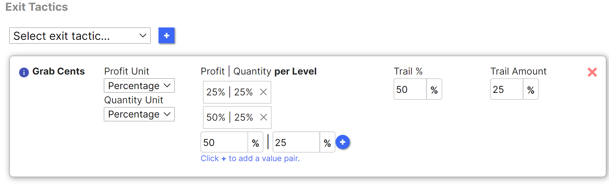
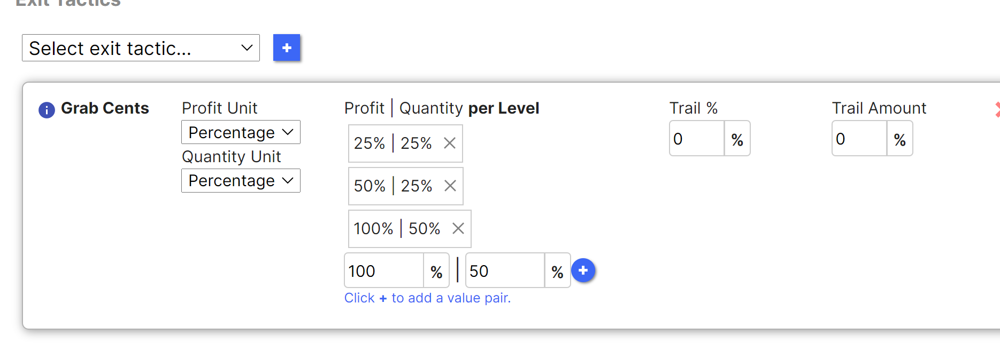
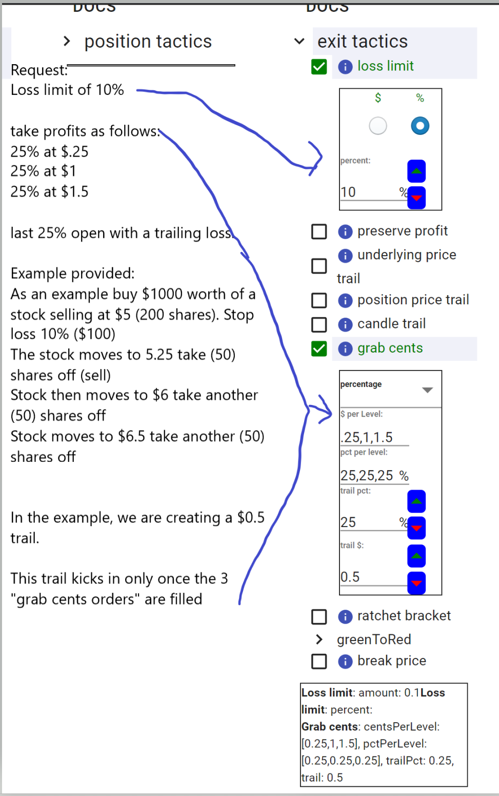

# Grab Cents Exit Tactic

## Overview

This tactic places resting orders for specific profit targets you hope to reach. Once all the resting orders are completed, you can start a trail on the position, hoping to grab as much additional profit as you can.

## Parameters
**grab cents mode**:

Whether you would like to set up the quantity your resting orders via percentage of the position, or through quantity per order.
$ per level:

How many cents per order you would like to take for profit. This is set up relative to the current avg fill price of the position. Let's say you have a position with average fill price of 100, and you would like to take profits on a 25,50, and 75 cent gain. You would provide us a list: .25,.5,.75, and we would translate that into orders with limit prices: 100.25, 100.5, and 100.75.

**quantity/percentage per level**

Depending on the grab cents mode, define the quantity per resting order. If you choose percentage, and would like to place 3 resting orders, each accounting for 25% of your position, you would supply us a list: 25,25,25. Similarly, if you would like us to sell orders in quantities of 4,3, and then 2, you would select grab cents mode as quantity, and provide us a list here of: 4,3,2.

**trail quantity/percentage**

Depending on grab cents mode, the pct or the quantity of the position you would like to leave as a trail. If position is of size 5, grab cents mode is percentage, and the trail percentage is 20%, the trail will kick in once position has size 1. Similarly, if instead of percentage, you went with grab cents mode of quantity, and the trail quantity was set to 1, when the position has size 1, this trail will kick in.

**trail amount**

The amount of cents that you would like to have your trail set for. This trail will adjust in the direction of your position. So if long and your trail is .25, and current price is 100, the trail will be set to 99.75. If price moves to 100.25, the trail will be adjusted to 100. If it hits 100, the position will flatten.

## Example
Let's say you take a position of quantity 5. You would like to close 2 qty if the position ever gains 10 cents, another 2 if the position ever gains 25 cents, and leave a trail afterwards. That's what this tactic accomplishes.

12/30/21

grab cent with qty unit of percentage, profit unit of percentage examples.

for all these examples, let's assume a fill price of $1 and qty of 8.

_Image One_

the first image, is saying put one order out for a 25% gain for 25% of the position, and another for 50% gain for another 25% of the position. For the last 50%, create a 25% position price trail (like youd have on TOS) that kicks in once that order is filled. This 25% is based on the original fill price.

So this translates to 2 orders: order1 will have a qty of 2 and limit price of 1.25, order2 will have a qty of 2 and limit price of 1.5. A $.25 price trail (25%) will be created once those 2 orders fill

_Image two_

the second image, is saying put one order out for a 25% gain for 25% of the position, another for 50% gain for another 25% of the position, and one more for a 100% gain on 50% of the position. There is no price trail.

So this translates to 3 orders: order1 will have a qty of 2 and limit price of 1.25, order2 will have a qty of 2 and limit price of 1.5, and order3 will have a qty of 4 and a limit price of 2.

## Notes
The trailing stop for Grab Cents differs from underlying price trail and position price trail in the following ways: 
1) It is a trail on the position and not the underlying.
2) It only takes effect once your resting orders have filled, unlike the price trails, which are in effect immediately.
3) Additionally, the grab cents percentages do not have to equal 100%. If you would like to place 50% of your position on grab cents, and have the rest rely on a candle trail, you can do that.
4) If you elect grab cents percentage mode and the quantities do not match perfectly, we do our best to round efficiently.

## See also
[Candle Magnitude Exit](candle_magnitude.md)

[Ratchet Bracket](ratchet_bracket.md)

## Video

