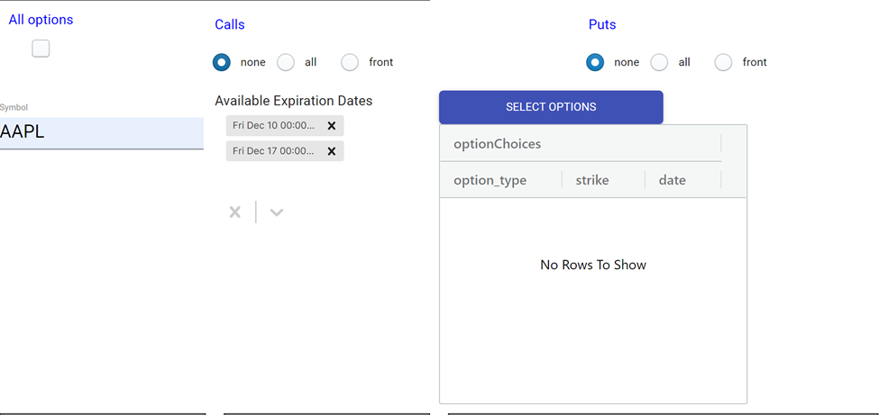
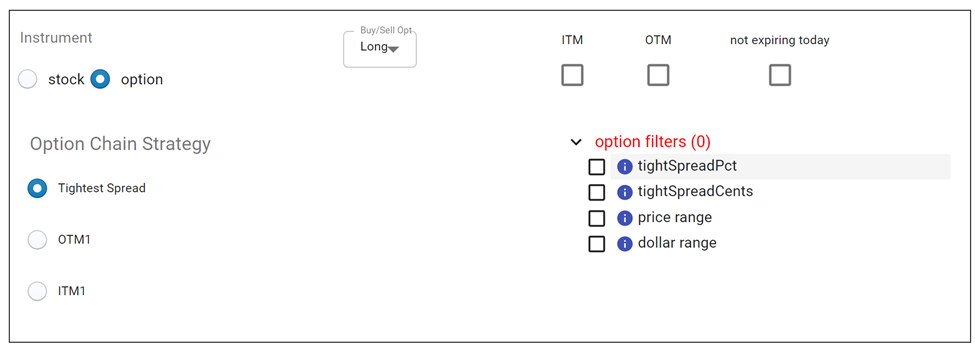

# Option Selection

Option selection occurs in two phases, first at the creation of the Trade Plan, but then also at the time of entry. The most important thing to be aware of is that at the time of entry, by regulatory rules, we can **only** select from those option contracts (expirations and strikes) that you have already approved when creating the Trade Plan.

### Option "Approval"

This part of the Trade Plan form is where you select the options that you approve of Trade Unafraid trading for you. You can select the expirations that you are interested in trading my editing the table beneath **Available Expiration Dates**.  You can control these expirations using the X's to remove and the chevron to add to the list of allowed expirations.  By default, we provide you the two nearest expirations.  For most stocks and ETFs, expirations are on Fridays, though SPY options expire every Monday, Wednesday, and Friday (as well as month-end).  There is also the setting for **not expiring today** which can push the front two expirations if today is an option expiration day.

By clicking the **SELECT OPTIONS** button, you can manually choose by checkboxes exactly which contract or contracts you are willing to trade.  The pop-up dialog box will contain only options for the expirations that you have selected, and then you can use checkboxes to include or exclude individual contracts.

You can use the controls on the main form to quickly cull the list without having to open the pop-up dialog box, selecting from **All options**, and **none**, **all**, or **front** for Calls and Puts separately.  **Front** will select only the nearest expiration *from the chains that you selected under **Available Expiration Dates***. **All** will select all the expirations *from the chains that you selected under **Available Expiration Dates***. **None** will mean you cannot trade any of the Calls or Puts where **None** is selected.

Whatever options are available to trade are displayed in the table of option choices.  If the table is empty, you will not have any options available to trade when your setup triggers.  The table may also contain a very large number of options, from which Trade Unafraid will choose the best choice at the time the setup triggers.

Once those are selected, you can move on to the option configuration section.

:::info 

Your settings in User Preferences play a part in the defaults in this section. 

:::

### Option Criteria
In the section above, you specified those contracts that you approve of trading.  Any of them may end up being the contract selected at entry time.  In this section, you will configure how Trade Unafraid will automate final option selection based on your criteria. 

:::danger Critical

The one thing to note in this section is that if **option filters** is shown in red and has a 0 next to it, it means that there are no options which satisfy your option selection criteria, which means that if a setup were to trigger at this moment, the trade would be skipped, because there are no options that qualify.

This can happen for a variety of reasons, such as your quantity basis being too small, e.g. you try to buy TSLA options, but the dollar amount for your market order entry tactic is just $50, so there are no options to purchase for that amount of money.

If you run into this situation, try removing option filters and criteria until the number of matches becomes non-zero.  Then you can revisit your filters and criteria one-by-one, so that you can reduce your choices while still having more than zero.

:::

#### Option Chain Strategy
##### Tightest Spread

This strategy will parse through the chain, and, after finding all the options that pass your option filters, select the one with the tightest spread. If you use this strategy, it is best to do so under one of the following circumstances.

1. You have manually selected a group of options, and you are okay with trading any of them, and you just want the one with the tightest spread.

2. You have filled out the **option filters** section in order to make sure you select the option with the characteristics that meet your criteria. This could be in terms of the dollar amount invested in the trade, the price of the trade, the option spread, or the number of contracts bought.

:::danger 

Without either of these, it is likely that the Trade Unafraid will select an option that is unfavorable for you. It is software, and it does exactly what you tell it to do.  Very often, what will happen is that the tightest spread at the time of entry happens to be a very deep OTM option, perhaps trading at .10 x .11.  It will have a tiny delta and not move, even though its spread is technically the tightest available.  And you could end up buying many of them, based on your trade allocation.

:::

##### OTM1:
Selects the nearest out of the money option. All the option filters still apply, so you can tell the software to do something like take the nearest out the money option as long as the spread is under 10%. If multiple expirations are selected, Trade Unafraid will find the OTM1 option for each of those and trade the one with the tightest spread.

If OTM1 is selected, it is important to make sure you have included the OTM1 contract in the Option Approval section above.  Trade Unafraid can only trade options that you have approved.  If the option that ends up being the nearest out-of-the-money strike is not in the list of approved contracts from above, then the OTM1 contract will not be allowed to trade, and your setup will end up failing to enter, because there is no contract that meets your criteria.  (It is safest to use the option shortcuts **all** or **front** when selecting OTM1 to ensure that the OTM1 contract will be approved to trade.)

Additionally, if you try to manually select an option that is specifically not OTM1, and leave the configuration on OTM1, this will result in no option being selectable at the time of trade. There have been a few cases where a user tried to manually select a non-OTM1 option and failed to enter the trade because OTM1 was still the strategy of choice.

##### ITM1:
Selects the nearest in the money option. All the option filters still apply, so you can tell the software to do something like take the nearest in the money option as long as the spread is under 10%. If multiple expirations are selected, Trade Unafraid will find the nearest in the money option for each of those and trade the one with the tightest spread.

If ITM1 is selected, it is important to make sure you have included the ITM1 contract in the Option Approval section above.  Trade Unafraid can only trade options that you have approved.  If the option that ends up being the nearest in-the-money strike is not in the list of approved contracts from above, then the ITM1 contract will not be allowed to trade, and your setup will end up failing to enter, because there is no contract that meets your criteria.  (It is safest to use the option shortcuts **all** or **front** when selecting ITM1 to ensure that the ITM1 contract will be approved to trade.)

Additionally, if you try to manually select an option that is specifically not ITM1, and leave the configuration on ITM1, this will result in no option being selectable at the time of trade. There have been a few cases where a user tried to manually select a non-ITM1 option and failed to enter the trade because ITM1 was still the strategy of choice.

#### Option Filters

OTM

    These are "pass filters," so selecting this means that only OTM 
    options will be considered, and ITM options are rejected.

ITM

    These are "pass filters," so selecting this means that only ITM
    options will be considered, and OTM options are rejected.

:::

What happens if you check both OTM and ITM?

:::

Not expiring today

    Rejects any options that expire today.

Tight spread pct

    Removes all options that have spreads over this percentage. If
    you input 10%, this will remove all options that have a bid/ask spread
    wider than 10%. This feature attempts to calculate an average of the
    past few quotes to determine if it is consistently a bad spread,
    or perhaps just one bad quote. This filter should only be used if
    the user is trading options whose spreads can be very volatile,
    such as TDOC, CRM, etc. If you are trading a stock like TSLA, it
    can happen that you get a TSLA option with a bad spread
    momentarily and have the trade filtered out by this setting.

Tight spread cents

    Removes all options that have spreads wider than this dollar 
    amount. If you input .25, this will remove all options that have
    spreads wider than 25 cents.

Price range

    This is also a "pass filter." Only options that are within this price 
    range can be traded. If you input a min of 2, and a max of 5, this will 
    filter out all options whose price is less than 2 or greater than 5.

Qty/Dollar range

    If your trade plan quantity basis is Dollars (in the top left of
    the form), then the "option range" filter will be available. If
    your trade plan quantity basis is Qty, then the "qty range"
    filter will be available.

    Dollar range is used in the following scenario. Let’s say you have QTY
    selected for your trade plan, and you set the qty basis of the market
    order entry tactic to 5 contracts. From those 5 contracts, you’d like
    to only trade options that will result in a specific Dollar range
    invested. You could do something like set the "min dollar" to $1500,
    and the "max dollar" to $2000. With this, Trade Unafraid will know to only select
    from options that have a price between 3 and 4, which, if multiplied
    by 5 contracts, will result in the minimum cost basis of $1500 to
    $2000.

    Qty range is used in the following scenario. Let’s say you have Dollars
    selected for your trade plan, and you set the qty basis of the market
    order entry tactic to $2000. From those $2000, you’d like to only
    trade options that will result in a specific number of contracts. You
    could do something like set the "min qty" to 5 contracts, and the "max
    qty" to 10 contracts. With this, Trade Unafraid will specifically only select
    options that will result in $2000 cost basis, but result in a position of 
    5 to 10 contracts.
