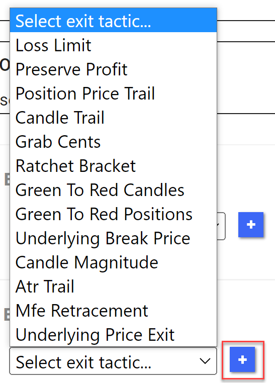
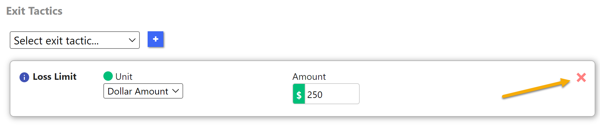

# Exit Tactics

Exit Tactics are a vital part of crafting a successful trade plan with Trade Unafraid. These tactics define how and under which conditions your trade plan will close your position or a portion of your position. Becoming familiar with each of these tactics will prove invaluable in your journey as a successful trader using the Trade Unafraid platform.

You will find a detailed explanation of each Exit Tactic along with some helpful examples in the Reference section of the left nav bar.

To add a tactic to your trade plan, select it from the dropdown and push the **+** button to add it to the trade plan. 

To remove a tactic, simply click on the red **x** in the top right corner.

 

A trade plan can have multiple exit tactics, and they will all function independently but cooperatively. Even though the combination of all exit tactics may account for many times the actual quantity of your position, the orders will execute as they occur, and the remaining tactics will adjust to the new position quantity.  _This is part of the magic of Trade Unafraid._

## Three Domains

There are three domains in which an Exit Tactic operates.  It can take actions based on
1. The price of the underlying
2. The price of the instrument being traded (for stock trades, 1 & 2 are the same; for option trades, they are different)
3. The profit/loss (pnl) of the position

:::tip

Keeping these three domains in mind will help you to understand the way various Exit Tactics function.

:::

### Exit Tactics Based on the Position P&L

[Green-to-Red Position](/Reference/Exit%20tactics/gtr_positions.md)

[Loss Limit](/Reference/Exit%20tactics/loss_limit.md)

[MFE Retracement](/Reference/Exit%20tactics/mfe_retracement.md) (when MFE Type is set to PnL)

[Preserve Profit](/Reference/Exit%20tactics/preserve_profit.md)

[Ratchet Bracket](/Reference/Exit%20tactics/ratchet_bracket.md) (when Qty Basis is set to Profit)

### Exit Tactics Based on the Price of the Instrument Being Traded

:::info

When trading shares of stock, these Exit Tactics are the same as those based on price of the underlying.  When trading options, they are different.

:::

[Grab Cents](/Reference/Exit%20tactics/grab_cents.md)

[MFE Retracement](/Reference/Exit%20tactics/mfe_retracement.md) (when MFE Type is set to Position Price)

[Position Price Trail](/Reference/Exit%20tactics/position_price_trail.md)

[Ratchet Bracket](/Reference/Exit%20tactics/ratchet_bracket.md) (when Qty Basis is set to Quantity or Percentage)

### Exit Tactics Based on the Price of the Underlying

:::info

When trading shares of stock, these Exit Tactics are the same as those based on position price.  When trading options, they are different.

:::

[ATR Trail](/Reference/Exit%20tactics/atr_trail.md)

[Candle Magnitude](/Reference/Exit%20tactics/candle_magnitude.md)

[Candle Trail](/Reference/Exit%20tactics/candle_trail.md)

[Green-to-Red Candles](/Reference/Exit%20tactics/gtr_candles.md)

[Underlying Break Price](/Reference/Exit%20tactics/underlying_break_price.md)

[Underlying Price](/Reference/Exit%20tactics/underlying_price.md)

